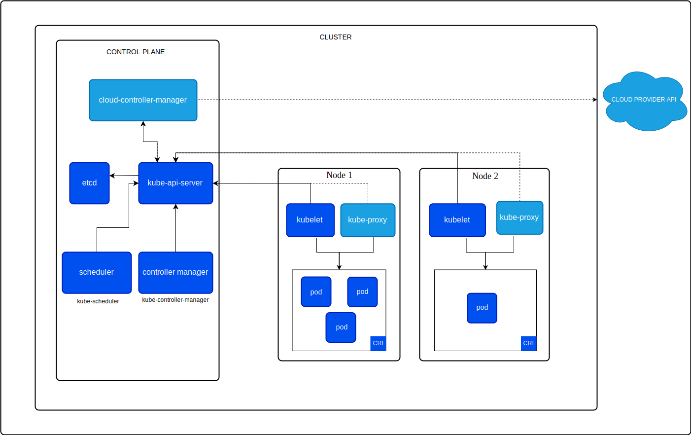

# Cluster Architecture

- A `Kubernetes cluster` consists of *a control plane* plus a *set of worker machines*, called **nodes**, that run *containerized applications*. Every cluster needs at *least one worker node* in order to run `Pods`.

## Control plane components

- The control plane's components make global decisions about the cluster (for example, scheduling), as well as detecting and responding to cluster events (for example, starting up a new pod when a Deployment's replicas field is unsatisfied).

### kube-apiserver

- The API server is a component of the `Kubernetes` *control plane* that exposes the `Kubernetes API`. The `API server` is the front end for the `Kubernetes` control plane.
- The main implementation of a `Kubernetes API server` is [kube-apiserver](https://kubernetes.io/docs/reference/generated/kube-apiserver/). `kube-apiserver` is designed to scale horizontally—that is, it scales by deploying more instances. You can run several instances of `kube-apiserver` and balance traffic between those instances.

### etcd

- Distributed key-value store that `Kubernetes` uses to store all cluster data. `etcd` is a consistent and highly-available key value store used as `Kubernetes`'s backing store for all cluster data.

### kube-scheduler

- Control plane component that watches for newly created Pods with no assigned node, and selects a node for them to run on.
- Factors taken into account for scheduling decisions include: individual and collective resource requirements, hardware/software/policy constraints, affinity and anti-affinity specifications, data locality, inter-workload interference, and deadlines.

### kube-controller-manager

- Control plane component that runs *controller processes*.
- Logically, each controller is a separate process, but to reduce complexity, they are all compiled into a single binary and run in a single process. Some type of Controller:
  - Node controller: Responsible for noticing and responding when nodes go down.
  - Job controller: Watches for Job objects that represent one-off tasks, then creates Pods to run those tasks to completion.
  - EndpointSlice Controller: Populates EndpointSlice objects (to provide a link between Services and Pods)
  - ServiceAccount controller: : Create default ServiceAccounts for new namespaces.

## Node Components

- Node components run on every node, maintaining running pods and providing the `Kubernetes` runtime environment.

### kubelet

- An *agent* that runs on each node in the cluster. It makes sure that containers are running in a Pod.

### kube-proxy

- kube-proxy is a network proxy that runs on each node in your cluster, implementing part of the `Kubernetes Service` concept.
- kube-proxy maintains network rules on nodes. These network rules allow network communication to your Pods from network sessions inside or outside of your cluster.

### Container runtime

- A fundamental component that empowers `Kubernetes` to run containers effectively. It is responsible for managing the execution and lifecycle of containers within the `Kubernetes` environment.
