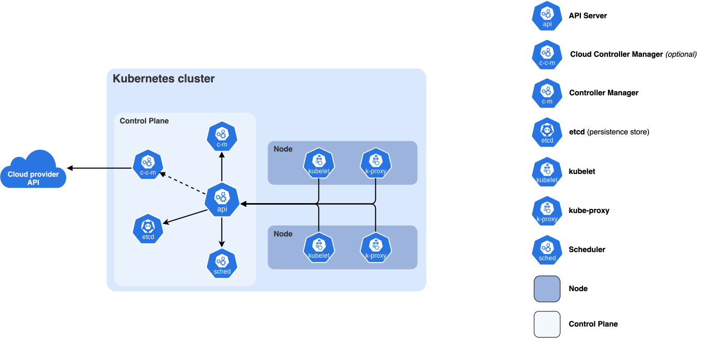

# Introduction

- [Kubernetes](https://kubernetes.io/docs/concepts/overview/), also known as `K8s`, is an open-source system for automating deployment, scaling, and management of containerized applications. `Kubernetes` is a portable, extensible, open source platform for managing containerized workloads and services, that facilitates both declarative configuration and automation. It has a large, rapidly growing ecosystem. `Kubernetes` services, support, and tools are widely available.
- Planet Scale: Designed on the same principles that allow Google to run billions of containers a week, `Kubernetes` can scale without increasing your operations team.
- Never Outgrow: Whether testing locally or running a global enterprise, `Kubernetes` flexibility grows with you to deliver your applications consistently and easily no matter how complex your need is.
- Run `K8s` Anywhere: `Kubernetes` is open source giving you the freedom to take advantage of on-premises, hybrid, or public cloud infrastructure, letting you effortlessly move workloads to where it matters to you.

# Components

## Core components

- A `Kubernetes cluster` consists of a *control plane* and *one or more worker nodes*. Here's a brief overview of the main components:

### Control Plane Components

- Manage the overall state of the cluster:
  - [**kube-apiserver**](https://kubernetes.io/docs/concepts/architecture/#kube-apiserver): The core component server that exposes the Kubernetes HTTP API.
  - [**etcd**](https://kubernetes.io/docs/concepts/architecture/#etcd): Consistent and highly-available key value store for all API server data.
  - [**kube-scheduler**](https://kubernetes.io/docs/concepts/architecture/#kube-scheduler): Looks for Pods not yet bound to a node, and assigns each Pod to a suitable node.
  - [**kube-controller-manager**](https://kubernetes.io/docs/concepts/architecture/#kube-controller-manager): Runs controllers to implement Kubernetes API behavior.
  - [**cloud-controller-manager**](https://kubernetes.io/docs/concepts/architecture/#cloud-controller-manager): Integrates with underlying cloud provider(s).

### Node Components

- Run on every node, maintaining running pods and providing the Kubernetes runtime environment:
  - [**kubelet**](https://kubernetes.io/docs/concepts/architecture/#kubelet): Ensures that Pods are running, including their containers.
  - [**kube-proxy**](https://kubernetes.io/docs/concepts/architecture/#kube-proxy): Maintains network rules on nodes to implement Services.
  - [**Container runtime**](https://kubernetes.io/docs/concepts/architecture/#container-runtime): Software responsible for running containers.
