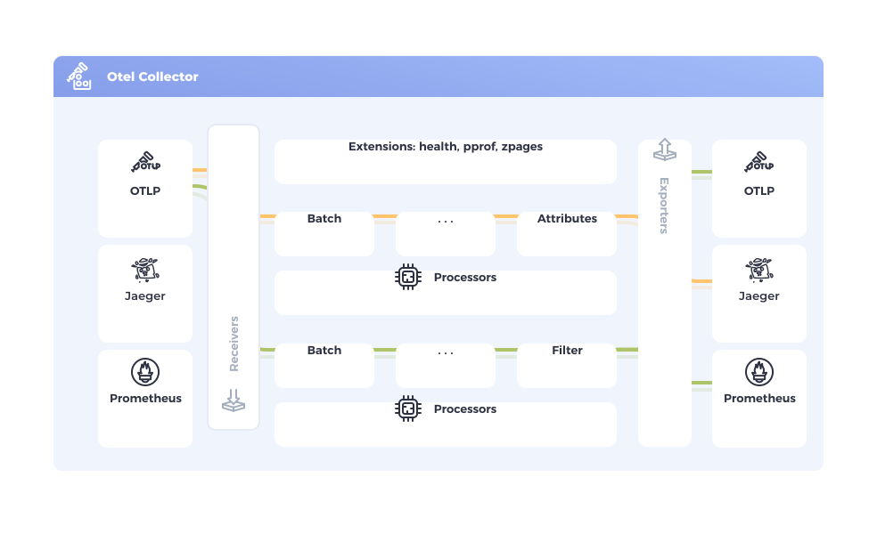

# OpenTelemety Collector

- Vendor-agnostic way to receive, process and export telemetry data.

## Introduction

- The `OpenTelemetry Collector` offers a *vendor-agnostic implementation* of how to `receive`, `process` and `export` telemetry data. It removes the need to *run*, *operate*, and *maintain* **multiple agents/collectors**. This works with improved *scalability* and supports open source observability data formats (e.g. `Jaeger`, `Prometheus`, `Fluent Bit`, etc.) sending to one or more open source or *commercial backends*.

## Objectives

- *Usability*: Reasonable default configuration, supports popular protocols, runs and collects out of the box.
- *Performance*: Highly stable and performant under varying loads and configurations.
- *Observability*: An exemplar of an observable service.
- *Extensibility*: Customizable without touching the core code.
- *Unification*: Single codebase, deployable as an agent or collector with support for `traces`, `metrics`, and `logs`.
