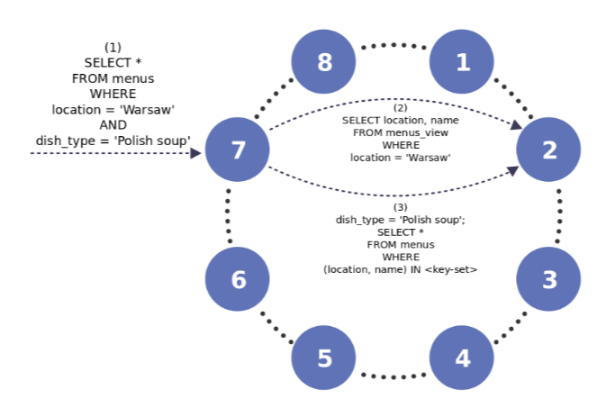

# Secondary Index

## GSI (Global Secondary Index)

- **Global Secondary indexes** (named “*Secondary indexes*” for the rest of this doc) are a *mechanism* in ScyllaDB which *allows efficient searches* on *non-partition keys* by creating an index
- Secondary indexes provide the following advantages:
  - *Secondary Indexes* are (mostly) transparent to your application. Queries have access to all the columns in the table, and you can add or remove indexes on the fly without changing the application.
  - We can use the value of the indexed column to find the corresponding index table row in the cluster so that reads are scalable.
  - Updates can be more efficient with secondary indexes than materialized views because only changes to the primary key and indexed column cause an update in the index view.

### How Secondary Index Queries Work

- ScyllaDB breaks indexed queries into two parts:
  - A query on the index table to retrieve partition keys for the indexed table, and
  - A query to the indexed table using the retrieved partition keys.
- Example, given the following schema:

```sql
CREATE TABLE buildings  (name text, city text, height int, PRIMARY KEY (name));

INSERT INTO buildings(name,city,height) VALUES ('Burj Khalifa','Dubai',828);
INSERT INTO buildings(name,city,height) VALUES ('Shanghai Tower','Shanghai',632);
INSERT INTO buildings(name,city,height) VALUES ('Abraj Al-Bait Clock Tower','Mecca',601);
INSERT INTO buildings(name,city,height) VALUES ('Ping An Finance Centre','Shenzhen',599);
INSERT INTO buildings(name,city,height) VALUES ('Lotte World Tower','Seoul',554);
INSERT INTO buildings(name,city,height) VALUES ('One World Trade Center','New York City',541);
INSERT INTO buildings(name,city,height) VALUES ('Guangzhou CTF Finance Centre','Guangzhou',530);
INSERT INTO buildings(name,city,height) VALUES ('Tianjin CTF Finance Centre','Tianjin',530);
INSERT INTO buildings(name,city,height) VALUES ('China Zun','Beijing',528);
INSERT INTO buildings(name,city,height) VALUES ('Taipei 101','Taipei',508);
```

```sql
SELECT * FROM buildings WHERE city = 'Shenzhen'; -- will error because city is not partition key
```

- *Secondary indexes* are designed to *allow efficient querying* of *non-partition* key columns. We can create an index on city by with the following CQL statements:

```sql
CREATE INDEX buildings_by_city ON buildings (city);

-- Query using the secondary index
SELECT * FROM buildings WHERE city = 'Shenzhen';

-- Result:
name                   | city     | height
-----------------------+----------+--------
Ping An Finance Centre | Shenzhen |    599
(1 rows)
```

- Note that you can use the `DESCRIBE` command to see the whole *schema* for the buildings table, including *created indexes* and *views*:

```sql
cqlsh:mykeyspace> DESC buildings;

CREATE TABLE mykeyspace.buildings (
             name text PRIMARY KEY,
             city text,
             height int
) WITH bloom_filter_fp_chance = 0.01
AND caching = {'keys': 'ALL', 'rows_per_partition': 'ALL'}
...;

CREATE INDEX buildings_by_city ON mykeyspace.buildings (city);

CREATE MATERIALIZED VIEW mykeyspace.buildings_by_city_index AS
SELECT city, idx_token, name
FROM mykeyspace.buildings
WHERE city IS NOT NULL
PRIMARY KEY (city, idx_token, name)
WITH CLUSTERING ORDER BY (idx_token ASC, name ASC)
AND bloom_filter_fp_chance = 0.01
AND caching = {'keys': 'ALL', 'rows_per_partition': 'ALL'}
...
```

## LSI (Local Secondary Index)

- **Local Secondary Indexes** is an `enhancement` to **Global Secondary Indexes**, which allows ScyllaDB to *optimize workloads* where the partition key of the base table and the index are the same key.

[!Note]
Updates for *local secondary indexes* are *`performed synchronously`*. When updates are *`synchronous`*, the client acknowledges the write operation only after both the base table modification and the view update are written. This is important to note because the process is *no longer `asynchronous`*, and the modifications are immediately reflected in the index. In addition, if the view *update fails*, the client `receives` a write `error`.

```sql
CREATE TABLE menus (location text, name text, price float, dish_type text, PRIMARY KEY(location, name));
CREATE INDEX ON menus((location),dish_type);
```

- As the same `partition key` is used for the base table (menus) and the Index, one node holds both. When using a *`Token Aware Driver`*, the same node is likely the coordinator, and the query does not require any *inter-node communication*.

### How Local Secondary Index Queries Work

- Lets explore the example above, first with *Global Secondary Index* (`GSI`) and then with *Local Secondary Index* (`LSI`)

```sql
-- Global Secondary Index
CREATE TABLE menus (location text,
      name text, price float,
      dish_type text,
      PRIMARY KEY(location, name));

INSERT INTO menus (location, name, price, dish_type) VALUES ('Reykjavik', 'hakarl', 16, 'cold Icelandic starter');
INSERT INTO menus (location, name, price, dish_type) VALUES ('Reykjavik', 'svid', 21, 'hot Icelandic main dish');
INSERT INTO menus (location, name, price, dish_type) VALUES ('Da Lat', 'banh mi', 5, 'Vietnamese breakfast');
INSERT INTO menus (location, name, price, dish_type) VALUES ('Ho Chi Minh', 'goi cuon', 6, 'Vietnamese hot starter');
INSERT INTO menus (location, name, price, dish_type) VALUES ('Warsaw', 'sorrel soup', 5, 'Polish soup');


CREATE INDEX ON menus(dish_type);
-- The create Index does not include the base partition key. As a result, the following query will work, but in an inefficient manner:
SELECT * FROM menus WHERE location = 'Warsaw' and dish_type = 'Polish soup';
```

- With GSI, dish_type acts as the partition key of the index table and the query requires two inter-node hops


- **Local Secondary Index Example** Now let’s create an *LSI*, using the base table partition key, in this case location as partition key for the Index

```sql
CREATE INDEX ON menus((location), dish_type);
SELECT * FROM menus WHERE location = 'Warsaw' and dish_type = 'Polish soup';
```

- The same query can be done to one node, as the Index and Base table partitions are guaranteed to be on the same node.

- LSI flow:
  - The user provides query details to the `coordinator node` (1)
  - An indexing subquery (2) is used to fetch all matching base keys from the underlying materialized view.
  - The coordinator uses the resulting base key set to request appropriate rows from the base table (3), located in the **`same node`** as the Index
- Both the base table and the underlying materialized view have the *same partition keys* for *corresponding rows*. That means that *their data resides on the same node* and can thus be *executed locally*, without having to contact another node. When using a **token aware policy**, the entire query will be done with *`zero inter-node` communication*.
[!Note]
When the same table has both `LSI` and `GSI`, ScyllaDB will *automatically* use the right Index for each query.
